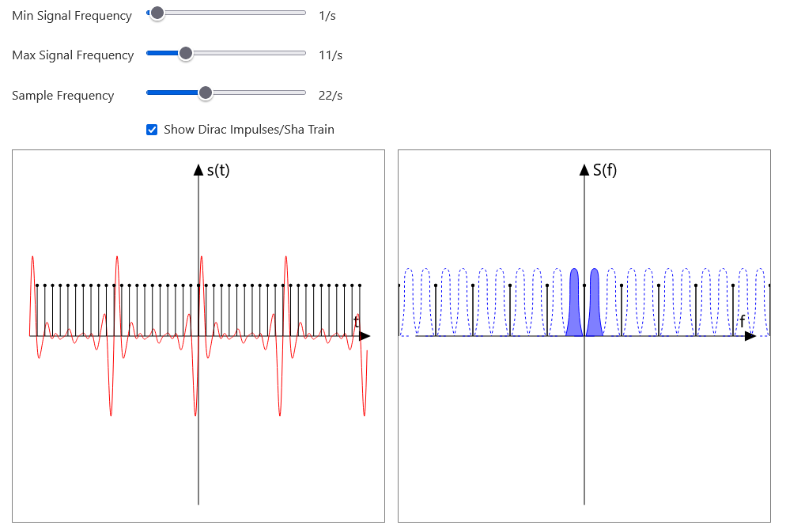

[Live Demo](https://static.laszlokorte.de/nyquist/)

# LTI System impulse response

On the left side you can see the continous signal in the time domain (t) in red. The timesteps at which is signal is samples are represented via vertical lines with a black dots at the top. They represent the Sha-Function which consists of the sum of many dirac impulses. Technically sampling the signal corresponds to a multiplication of the signal with the Sha-function.

On the right side you see the spectral domain with the signals spectrum represented via blue spikes. Only the spikes that are filled in blue represent the original frequencies of the continous signal. The other spikes are aliases of the true spectrum. They are caused by the multiplication of the signal with the Sha-function in the time domain(the sampling). A multiplication in the time domain corresponds to a convolution in the spectral domain. The spectrum of the Sha-function is also the Sha-function but with the inverse distance between spikes. Convolving the original spectrum with the Sha-function reproduces the original signal around each spike of the Sha-function

Play around the the min and max frequency of the signal to see how the spectrum changes. Play around with the sample frequency (the distance between the Sha-spikes) to see how increasing the distance in the time domain reduces the distance in the spectral domain. The original signal time domain can only be reconstructed from the spectral domain if the aliases do not overlap.